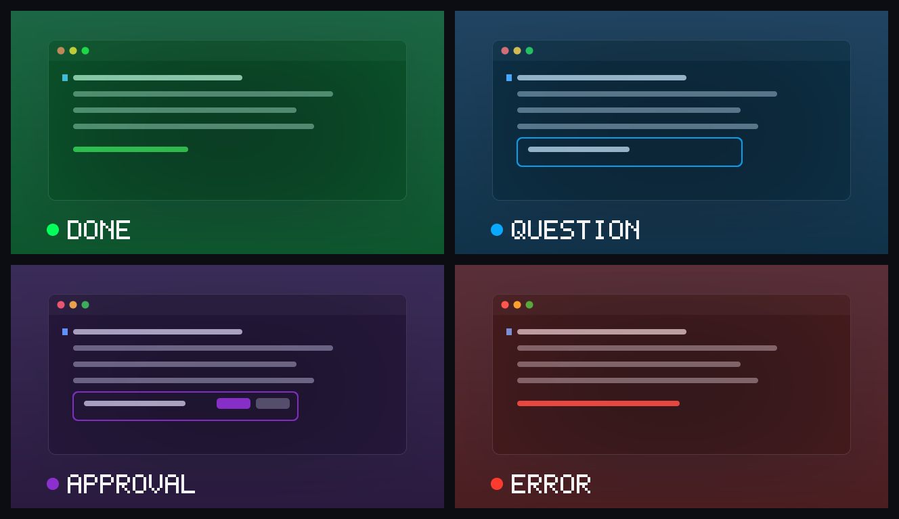
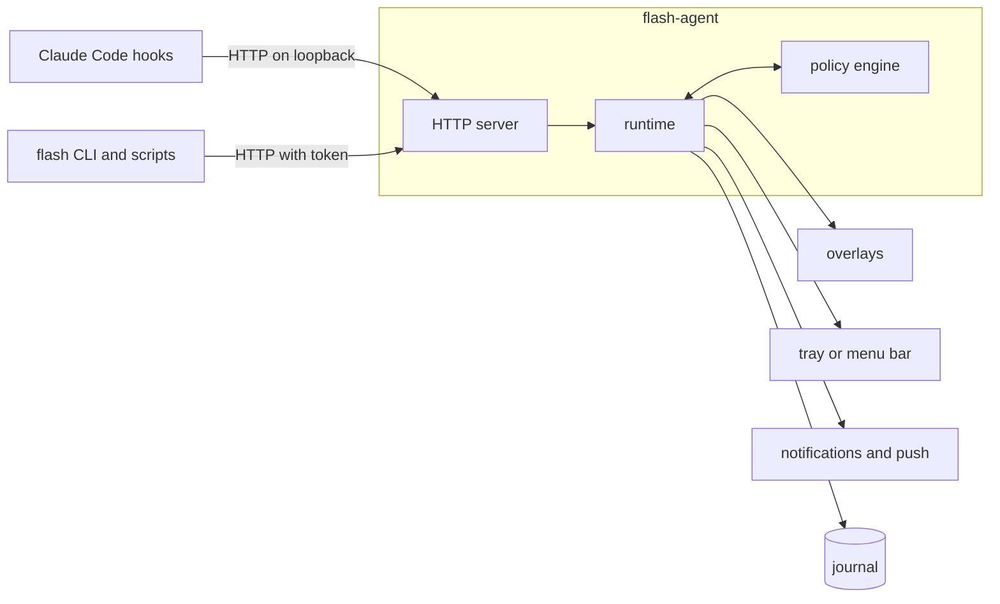

# Claude Flash


Claude Flash tints every display for about a second when Claude Code needs you:
when a turn finishes, when Claude asks you something, when a tool call is waiting
for your approval, and when a turn fails. Look away while Claude works; the flash
brings you back.

It runs on Windows and macOS. The overlay never takes focus and lets clicks
through, and pressing a key or clicking fades it early.



| Signal | Colour | Raised when |
|---|---|---|
| Done | `#00FF5A` | Claude finishes its turn |
| Question | `#08A9FF` | Claude asks a question, or an MCP server asks for input |
| Approval | `#8B2FCE` | A tool call is waiting for your permission |
| Error | `#FF3B30` | A turn ends in an API error |

Approval fires only when Claude Code actually shows a permission dialog. Calls
allowed by your permission mode or your rules never flash.

A question or an approval stays open until Claude moves on, so `flash status`, the
tray icon and the menu bar item can say what Claude is blocked on and for how
long. A session raises signals only once a prompt has been submitted in it, which
keeps subagents and sessions you are not driving quiet. After five minutes without
keyboard or mouse input the flashes become desktop notifications, and the first
flash after you come back reports what you missed.

[Install](#install) · [Commands](#usage) ·
[Configuration](docs/configuration.md) · [How it works](docs/how-it-works.md) ·
[Local API](docs/api.md)

## Install

### From a release

Download the archive for your platform from the
[latest release](https://github.com/anish-agr/claude-flash/releases/latest), then
run `flash install` from the extracted folder.

On Windows, in PowerShell:

```powershell
Expand-Archive claude-flash-windows-x64.zip -DestinationPath claude-flash
```

```powershell
.\claude-flash\flash.exe install
```

On macOS:

```bash
mkdir claude-flash && tar -xzf claude-flash-macos-universal.tar.gz -C claude-flash
```

```bash
xattr -dr com.apple.quarantine claude-flash && ./claude-flash/flash install
```

The programs are not code-signed. On macOS, `xattr` clears the quarantine flag
that Gatekeeper puts on downloads. On Windows, SmartScreen or Smart App Control
may ask before the first run.

### From source

With Rust 1.88 or later:

```bash
cargo install --locked --git https://github.com/anish-agr/claude-flash claude-flash
```

```bash
flash install --bin-dir ~/.cargo/bin
```

### What `flash install` does

1. Puts `flash` and `flash-agent` in a folder on your `PATH`:
   `%LOCALAPPDATA%\Microsoft\WindowsApps` on Windows and `~/.local/bin` on macOS,
   unless `--bin-dir` names another.
2. Writes a commented `config.toml`.
3. Adds hooks to `~/.claude/settings.json`. Every other setting and every other
   tool's hooks keep their content and their position, and the previous file is
   saved next to it as `settings.json.claude-flash-backup`.
4. Registers the agent to start at login: a `Run` registry value on Windows, a
   LaunchAgent on macOS.
5. Starts the agent.

Claude Code reads hooks when a session starts, so restart sessions that are
already open, then see [Check it works](#check-it-works).

| Option | Effect |
|---|---|
| `--bin-dir DIR` | Install the programs in another folder |
| `--no-hooks` | Leave `settings.json` alone |
| `--no-autostart` | Do not start the agent at login |
| `--desktop-toggle` | On Windows, add a desktop shortcut that turns flashes on and off |

`flash uninstall` removes the hooks and the login item and stops the agent.
`flash uninstall --purge` also deletes the settings and the journal.

## Check it works

`flash test` shows the four flashes on their own:

```bash
flash test
```

For the whole path, start a session and give Claude something short to do:

```bash
claude -p "Reply with just: ok"
```

The screen flashes green when the turn ends, and the journal says what arrived:

```text
$ flash log --since 15m
15:05:08  done      held back: background session  claude-flash
15:10:19  done      flash                          claude-flash
15:14:43  done      flash                          terminal-check
```

The column after the signal is what became of it, so a flash you expected and did
not see has its reason next to it. `--all` adds prompts and session starts and
ends, which is the quickest way to tell a session that never reached the agent
from one that was held back.

An approval flash needs a tool call your permission rules do not already allow;
leave the dialog open and `flash status` counts the wait while it stands. `flash
signal error --title "Build failed"` raises a red flash without waiting for an API
failure.

`flash doctor` checks the parts rather than the path, and says how to fix whatever
it finds:

```text
$ flash doctor
Claude Flash 2.0.0
✓ agent     running · pid 33972 · 127.0.0.1:47823
✓ settings  ~\AppData\Local\ClaudeFlash\config.toml
✓ hooks     13 events · ~\.claude\settings.json
✓ at login  ~\AppData\Local\Microsoft\WindowsApps\flash-agent.exe
✓ activity  last hook event PostToolUse 48s ago
✓ journal   ~\AppData\Local\ClaudeFlash\journal · 2 KB · kept 30 days
```

## Usage

```text
$ flash status
● on  agent 2.0.0 · pid 11208 · up 3h 12m
waiting   approval  Write in claude-flash  1m 20s · session 3aee9676
          question  pricetime  6s · session 91b0c2d4
today     14 done · 3 questions · 5 approvals · 0 errors · 21 flashes · 4 held back
hooks     installed
config    ~\AppData\Local\ClaudeFlash\config.toml
```

| Command | What it does |
|---|---|
| `flash status` | The switch, what Claude is waiting on, and today's counts |
| `flash on`, `flash off`, `flash toggle` | Turn flashes on or off |
| `flash pause 45m`, `flash resume` | Hold every signal for a while |
| `flash test [done question approval error]` | Show test flashes |
| `flash watch` | Follow signals as they happen |
| `flash log --since 6h` | What the journal recorded, including why a signal was held back |
| `flash stats --since 7d` | Signals, time spent waiting, busiest hours and projects |
| `flash signal KIND --title TEXT` | Raise a signal from a script |
| `flash config get KEY`, `set KEY VALUE`, `edit` | Read or change settings |
| `flash hooks install`, `uninstall`, `status` | Manage the hooks in `settings.json` |
| `flash agent start`, `stop`, `restart`, `logs` | Manage the background agent |
| `flash doctor` | Check every part of the setup |
| `flash completions SHELL` | Print a completion script for bash, zsh, fish, PowerShell or elvish |

`status`, `log`, `watch` and `stats` also print JSON with `--json`.

### Tray icon and menu bar item

The icon is the Claude Flash sphere in the colour of the current state: green when
on, the waiting signal's colour while Claude is blocked on you, amber while paused
and grey when off. Its menu lists what is waiting, turns flashes on and off, pauses
them, shows test flashes, chooses whether the agent starts at login, and opens the
settings file and the journal folder.

### Journal and statistics

```text
$ flash stats
Claude Flash · the last 7d

signals   142 done   18 questions   37 approvals   2 errors
shown as  171 flashes · 21 notifications · 3 pushes · 44 held back
          31 background session · 9 duplicate of a wait already signalled · 4 paused
waiting   37 waits · median 21s · p90 2m 10s · longest 14m 03s · 48m 12s in all
sessions  63 sessions · 211 prompts

by hour   ·······▁▂▅▇█▆▄▅▇▆▄▂▁▁····
          0     6     12    18   23

projects  pricetime     88 signals  31m 10s waiting
          claude-flash  61 signals  12m 40s waiting
```

The journal is one JSON object per line, one file per day, kept for 30 days. See
[what it records](SECURITY.md#what-is-stored).

### Signals from other tools

```bash
cargo test && flash signal done --title "Tests passed" || flash signal error --title "Tests failed"
```

These follow the same rules as signals from Claude Code: a pause, quiet hours,
project rules and presence all apply. Other programs can call the local HTTP API
directly; see [docs/api.md](docs/api.md).

### Scripted runs

Claude Code sessions started with `CLAUDE_FLASH=off` in their environment are left
out entirely:

```bash
CLAUDE_FLASH=off claude -p "Summarise the changes on this branch"
```

In PowerShell:

```powershell
$env:CLAUDE_FLASH = "off"; claude -p "Summarise the changes on this branch"
```

## Configuration

`config.toml` is in `%LOCALAPPDATA%\ClaudeFlash` on Windows and in
`~/Library/Application Support/claude-flash` on macOS; `flash config edit` opens
it. The agent applies changes within a second. If the file has a mistake, `flash
status` and `flash doctor` say so and the previous settings stay in effect.

```toml
[signals.approval]
color = "#8B2FCE"
# To soften a flash, lower its opacity. A lighter colour turns into white haze.
opacity = 0.2

[flash]
skip_when_focused = ["WindowsTerminal"]
# Flash again while Claude stays blocked on you.
remind_after = "10m"

[quiet_hours]
start = "22:00"
end = "08:00"

[push]
url = "https://ntfy.sh/your-private-topic"

[[project]]
match = "*/scratch/*"
mute = true
```

`flash config set` changes one value and keeps the comments around it:

```bash
flash config set signals.done.color "#FFD400"
```

Every setting and its default is listed in
[docs/configuration.md](docs/configuration.md).

## How it works



`flash install` registers HTTP hooks for twelve Claude Code events, delivered to
the agent on `127.0.0.1:47823`, and one command hook: each session runs
`flash agent ensure` when it starts, which starts the agent if it is not running.

| Hook event | What it means |
|---|---|
| `UserPromptSubmit` | You typed into this session, so it may flash |
| `Stop`, `StopFailure` | Done, Error |
| `PermissionRequest` | Approval, waiting on that `tool_use_id` |
| `PreToolUse` for `AskUserQuestion`, `Elicitation` | Question, waiting until answered |
| `Notification` | Question or Approval, merged with the event above when both describe one dialog |
| `PostToolUse`, `PostToolUseFailure`, `PermissionDenied`, `ElicitationResult` | The wait is over |
| `SessionStart`, `SessionEnd` | Session bookkeeping |

The agent answers every hook with an empty `200`, which Claude Code treats as a
hook that made no decision. Claude Flash cannot approve, deny or delay anything.

What an event means is decided by the policy engine in `flash-core`, which does no
I/O and reads no clock of its own. Its behaviour is specified by the
[scenarios in `spec/scenarios`](spec/scenarios), which CI runs on Windows, macOS
and Linux. Flashes never start less than 334 ms apart, so no burst of events can
exceed three flashes per second (WCAG 2.3.1), and a more urgent signal that
arrives during a flash is shown when the interval ends rather than dropped.

## Documentation

| Document | Contents |
|---|---|
| [docs/how-it-works.md](docs/how-it-works.md) | The hooks, the policy engine, and how a flash is drawn on each platform |
| [docs/configuration.md](docs/configuration.md) | Every setting, its default and what it accepts |
| [docs/api.md](docs/api.md) | The local HTTP API: admission, the token and every endpoint |
| [SECURITY.md](SECURITY.md) | What the agent exposes, what the journal stores, how to report a problem |
| [CONTRIBUTING.md](CONTRIBUTING.md) | The layout, the checks, and how behaviour changes are made |
| [CHANGELOG.md](CHANGELOG.md) | What changed in each version |

## Privacy and security

- The agent listens on loopback only, and refuses requests from web pages and from
  hosts that are not loopback. Endpoints that read or change anything need a token
  kept in the data directory.
- The journal records event names, signal kinds, project folder names, tool names
  and durations. It never records prompts, tool input or output, or Claude's
  replies; those fields are not even read from hook events.
- Nothing leaves the machine unless you set up push notifications.

Details are in [SECURITY.md](SECURITY.md).

## Compatibility

| Platform | Support |
|---|---|
| Windows 10 (1803 or later) and Windows 11 | Overlays on every monitor, tray icon, notifications |
| macOS 11 or later, Apple silicon and Intel | Overlays on every display and Space, menu bar item, notifications |
| Linux | Agent and CLI, with notifications through `notify-send`; no overlay |
| Claude Code in a terminal, the desktop app or an IDE extension | One install covers all of them: they read the same `~/.claude/settings.json`. Tested with Claude Code 2.1.231 |
| Claude Code on the web, or over SSH | Not reached. Hooks run on the machine Claude Code itself runs on |
| Claude Code in WSL | Its hooks run inside WSL, against WSL's own `~/.claude/settings.json`. Install the Linux build there for notifications; the Windows agent listens on loopback, which WSL's default networking cannot reach |
| Exclusive full-screen games | Overlays do not appear above them; borderless full screen works |

## Troubleshooting

`flash doctor` checks the agent, the token, the settings, the hooks, the login item
and recent activity, and says how to fix each problem it finds.

**Claude Code shows "hook error occurred".** The agent is not running, so Claude
Code cannot deliver events to it. Run `flash agent start`; sessions that start
afterwards start the agent themselves.

**A flash did not appear.** `flash log` shows each recent signal and what became of
it, such as `held back: background session` or `held back: quiet hours`.

**Windows blocks the programs.** Smart App Control and antivirus software can stop
unsigned programs. Allow `flash.exe` and `flash-agent.exe`, or build them from
source.

## Upgrading from 1.x

Run `flash install` from version 2. It converts `config.ini` into `config.toml`,
keeping colours, opacity, timing, the focus rule and the session filter; keeps
flashes off if they were off; replaces the 1.x hooks; and removes the files 1.x
used for bookkeeping. Sessions started before the upgrade keep their 1.x hooks
until they restart, and the new `flash` still understands them.

## Development

```bash
cargo test --workspace
```

[CONTRIBUTING.md](CONTRIBUTING.md) describes the layout, the scenario-first way
behaviour changes are made, and how to type-check the macOS front end from another
platform.

## License

[MIT](LICENSE). Claude Flash is an independent project and is not affiliated with
or endorsed by Anthropic.
