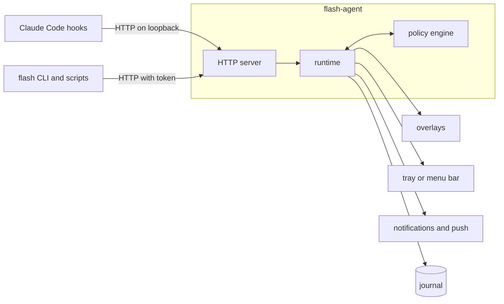

# Claude Flash


Claude Flash tints every display for about a second when Claude Code needs you:
when a turn finishes, when Claude asks you something, when a tool call is waiting
for your approval, and when a turn fails. Look away while Claude works; the flash
brings you back.

It runs on Windows and macOS. The overlay never takes focus and lets clicks
through, and pressing a key or clicking fades it early.


| Signal | Colour | Raised when |
|---|---|---|
| Done | `#00FF5A` | Claude finishes its turn |
| Question | `#08A9FF` | Claude asks a question, or an MCP server asks for input |
| Approval | `#8B2FCE` | A tool call is waiting for your permission |
| Error | `#FF3B30` | A turn ends in an API error |

Approval fires only when Claude Code actually shows a permission dialog. Calls
allowed by your permission mode or your rules never flash.

A question or an approval stays open until Claude moves on, so `flash status`, the
tray icon and the menu bar item can say what Claude is blocked on and for how
long. A session raises signals only once a prompt has been submitted in it, which
keeps subagents and sessions you are not driving quiet. After five minutes without
keyboard or mouse input the flashes become desktop notifications, and the first
flash after you come back reports what you missed.

[Install](#install) · [Getting started](docs/getting-started.md) ·
[Commands](#usage) · [Configuration](docs/configuration.md) ·
[How it works](docs/how-it-works.md) · [Local API](docs/api.md)

## Install

Each block is one command.

### With Homebrew or Scoop

On macOS, with [Homebrew](https://brew.sh):

```bash
brew install anish-agr/tap/claude-flash
```

On Windows, with [Scoop](https://scoop.sh):

```powershell
scoop install https://raw.githubusercontent.com/anish-agr/claude-flash/main/packaging/scoop/claude-flash.json
```

Then, on either, add the hooks and start the agent:

```bash
flash install
```

To update with Homebrew, run `brew upgrade claude-flash` and then
`flash agent restart`. Scoop cannot replace a program that is running, so run
`flash agent stop`, then `scoop update claude-flash`, then `flash agent start`.

### Windows

Without Scoop, in Windows PowerShell:

```powershell
cd $env:TEMP
```

```powershell
curl.exe -fLO https://github.com/anish-agr/claude-flash/releases/latest/download/claude-flash-windows-x64.zip
```

```powershell
Expand-Archive claude-flash-windows-x64.zip -DestinationPath claude-flash -Force
```

```powershell
.\claude-flash\flash.exe install
```

Type `curl.exe` in full: in Windows PowerShell, `curl` on its own runs a different
command.

### macOS

Without Homebrew, in Terminal:

```bash
cd "$TMPDIR"
```

```bash
curl -fLO https://github.com/anish-agr/claude-flash/releases/latest/download/claude-flash-macos-universal.tar.gz
```

```bash
mkdir -p claude-flash && tar -xzf claude-flash-macos-universal.tar.gz -C claude-flash
```

```bash
./claude-flash/flash install
```

The programs go in `~/.local/bin`, which is not on the macOS `PATH` unless
something else put it there. If `flash --version` says `command not found`, add it
for zsh, the default shell:

```bash
echo 'export PATH="$HOME/.local/bin:$PATH"' >> ~/.zshrc && source ~/.zshrc
```

### After installing

Claude Code reads hooks when a session starts, so quit every session that is
already open, in a terminal, the desktop app or your editor, and start it again.
Then see [Check it works](#check-it-works).
[docs/getting-started.md](docs/getting-started.md) walks through every check on
both platforms, and how to report a problem.

The programs are not code-signed. Downloaded with `curl` as above, they carry no
quarantine flag on macOS and no downloaded-from-the-internet mark on Windows, so
Gatekeeper and SmartScreen have nothing to act on. Smart App Control, when it is
on, blocks unsigned programs however they arrived.

### From source

With Rust 1.88 or later:

```bash
cargo install --locked --git https://github.com/anish-agr/claude-flash claude-flash
```

```bash
flash install --bin-dir ~/.cargo/bin
```

In PowerShell, write the folder as `$HOME\.cargo\bin`.

### What `flash install` does

1. Copies `flash` and `flash-agent` to `%LOCALAPPDATA%\Microsoft\WindowsApps` on
   Windows, which is already on the `PATH`, or to `~/.local/bin` on macOS, unless
   `--bin-dir` names another folder.
2. Writes a commented `config.toml`, unless one exists. The settings, the token and
   the journal live in `~\.claude-flash` on Windows and in
   `~/Library/Application Support/claude-flash` on macOS.
3. Adds hooks to `~/.claude/settings.json`. Every other setting and every other
   tool's hooks keep their content and their position, and the previous file is
   saved next to it as `settings.json.claude-flash-backup`.
4. Registers the agent to start at login: a `Run` registry value on Windows, a
   LaunchAgent on macOS.
5. Starts the agent.

| Option | Effect |
|---|---|
| `--bin-dir DIR` | Install the programs in another folder |
| `--no-hooks` | Leave `settings.json` alone |
| `--no-autostart` | Do not start the agent at login |
| `--desktop-toggle` | On Windows, add a desktop shortcut that turns flashes on and off |

### Uninstall

```bash
flash uninstall
```

This stops the agent and removes the hooks and the login item. Add `--purge` to
delete the settings, the journal and the saved state as well. The programs stay. If
Homebrew or Scoop installed them, remove them with `brew uninstall claude-flash` or
`scoop uninstall claude-flash`; otherwise delete them. On Windows:

```powershell
Remove-Item "$env:LOCALAPPDATA\Microsoft\WindowsApps\flash.exe", "$env:LOCALAPPDATA\Microsoft\WindowsApps\flash-agent.exe"
```

On macOS:

```bash
rm ~/.local/bin/flash ~/.local/bin/flash-agent
```

Then restart Claude Code once more. A session that is still open keeps the hooks it
loaded, and shows "hook error occurred" until it restarts.

## Check it works

`flash test` shows the four flashes on their own:

```bash
flash test
```

For the whole path, start a session and give Claude something short to do:

```bash
claude -p "Reply with just: ok"
```

The screen flashes green when the turn ends, and the journal says what arrived:

```text
$ flash log --since 15m
15:05:08  done      held back: background session  claude-flash
15:10:19  done      flash                          claude-flash
15:14:43  done      flash                          terminal-check
```

The column after the signal is what became of it, so a flash you expected and did
not see has its reason next to it. `--all` adds prompts and session starts and
ends, which is the quickest way to tell a session that never reached the agent
from one that was held back.

An approval flash needs a tool call your permission rules do not already allow;
leave the dialog open and `flash status` counts the wait while it stands. `flash
signal error --title "Build failed"` raises a red flash without waiting for an API
failure.

`flash doctor` checks the parts rather than the path, and says how to fix whatever
it finds:

```text
$ flash doctor
Claude Flash 2.2.0
✓ agent     running · pid 33972 · 127.0.0.1:47823
✓ settings  ~\.claude-flash\config.toml
✓ hooks     13 events · ~\.claude\settings.json
✓ at login  ~\AppData\Local\Microsoft\WindowsApps\flash-agent.exe
✓ activity  last hook event PostToolUse 48s ago
✓ journal   ~\.claude-flash\journal · 2 KB · kept 30 days
```

## Usage

```text
$ flash status
● on  agent 2.2.0 · pid 11208 · up 3h 12m
waiting   approval  Write in claude-flash  1m 20s · session 3aee9676
          question  pricetime  6s · session 91b0c2d4
today     14 done · 3 questions · 5 approvals · 0 errors · 21 flashes · 4 held back
hooks     installed
config    ~\.claude-flash\config.toml
```

| Command | What it does |
|---|---|
| `flash status` | The switch, what Claude is waiting on, and today's counts |
| `flash on`, `flash off`, `flash toggle` | Turn flashes on or off |
| `flash pause 45m`, `flash resume` | Hold every signal for a while |
| `flash test [done question approval error]` | Show test flashes |
| `flash watch` | Follow signals as they happen |
| `flash log --since 6h` | What the journal recorded, including why a signal was held back |
| `flash stats --since 7d` | Signals, time spent waiting, busiest hours and projects |
| `flash signal KIND --title TEXT` | Raise a signal from a script |
| `flash run -- COMMAND` | Run a command and signal whether it passed, keeping its exit code |
| `flash config get KEY`, `set KEY VALUE`, `edit` | Read or change settings |
| `flash hooks install`, `uninstall`, `status` | Manage the hooks in `settings.json` |
| `flash hooks remote HOST` | Print hooks for another machine that point at this agent |
| `flash agent start`, `stop`, `restart`, `logs` | Manage the background agent |
| `flash doctor` | Check every part of the setup |
| `flash completions SHELL` | Print a completion script for bash, zsh, fish, PowerShell or elvish |

`status`, `log`, `watch` and `stats` also print JSON with `--json`.

### Tray icon and menu bar item

The icon is the Claude Flash sphere in the colour of the current state: green when
on, the waiting signal's colour while Claude is blocked on you, amber while paused
and grey when off. Its menu lists what is waiting, turns flashes on and off, pauses
them, shows test flashes, chooses whether the agent starts at login, and opens the
settings file and the journal folder.

### Journal and statistics

```text
$ flash stats
Claude Flash · the last 7d

signals   142 done   18 questions   37 approvals   2 errors
shown as  171 flashes · 21 notifications · 3 pushes · 44 held back
          31 background session · 9 duplicate of a wait already signalled · 4 paused
waiting   37 waits · median 21s · p90 2m 10s · longest 14m 03s · 48m 12s in all
sessions  63 sessions · 211 prompts

by hour   ·······▁▂▅▇█▆▄▅▇▆▄▂▁▁····
          0     6     12    18   23

projects  pricetime     88 signals  31m 10s waiting
          claude-flash  61 signals  12m 40s waiting
```

The journal is one JSON object per line, one file per day, kept for 30 days. See
[what it records](SECURITY.md#what-is-stored).

### Signals from other tools

`flash run` puts a signal on the end of any command: green when it succeeds, red
when it fails. It exits with the command's own code, so it can sit in front of
anything without changing what a script or a build server makes of the result.

```bash
flash run -- cargo test
```

That line is the same in PowerShell, which has no `&&` or `||`. `--only-errors`
says nothing when the command passes, and `--title` replaces the notification
text. To raise a signal on its own:

```bash
flash signal done --title "Deploy finished"
```

These follow the same rules as signals from Claude Code: a pause, quiet hours,
project rules and presence all apply. Other programs can call the local HTTP API
directly; see [docs/api.md](docs/api.md).

### From another machine

Claude Code in WSL, over SSH or on a second computer runs its hooks there, and
reads that machine's own `~/.claude/settings.json`. Those hooks can still flash
this screen. First let the agent take events from outside, which also makes the
token necessary on every request, hook events included:

```bash
flash config set agent.remote true
```

```bash
flash agent restart
```

Then print hooks for the other machine, naming this one as that machine reaches
it:

```bash
flash hooks remote 192.168.1.5
```

The settings go to standard output; merge them into `~/.claude/settings.json` over
there. Claude Flash does not need to be installed on that machine, because the
hooks are plain HTTP. They carry this agent's token, so treat that file as a
secret.

Windows asks to allow the agent through the firewall the first time it listens
this way. Inside WSL, `127.0.0.1` means WSL itself; the Windows host is the
default gateway, which `ip route show default | awk '{print $3}'` prints. With
WSL's mirrored networking, `127.0.0.1` reaches the host directly.

### Scripted runs

Claude Code sessions started with `CLAUDE_FLASH=off` in their environment are left
out entirely:

```bash
CLAUDE_FLASH=off claude -p "Summarise the changes on this branch"
```

In PowerShell:

```powershell
$env:CLAUDE_FLASH = "off"; claude -p "Summarise the changes on this branch"
```

## Configuration

`config.toml` is in `~\.claude-flash` on Windows and in
`~/Library/Application Support/claude-flash` on macOS; `flash config edit` opens
it. The agent applies changes within a second. If the file has a mistake, `flash
status` and `flash doctor` say so and the previous settings stay in effect.

```toml
[signals.approval]
color = "#8B2FCE"
# To soften a flash, lower its opacity. A lighter colour turns into white haze.
opacity = 0.2
# Play this signal's system sound as well.
sound = true

[flash]
skip_when_focused = ["WindowsTerminal"]
# Flash again while Claude stays blocked on you.
remind_after = "10m"

[quiet_hours]
start = "22:00"
end = "08:00"

[push]
url = "https://ntfy.sh/your-private-topic"

[[project]]
match = "*/scratch/*"
mute = true
```

`flash config set` changes one value and keeps the comments around it:

```bash
flash config set signals.done.color "#FFD400"
```

Every setting and its default is listed in
[docs/configuration.md](docs/configuration.md).

## How it works



`flash install` registers HTTP hooks for twelve Claude Code events, delivered to
the agent on `127.0.0.1:47823`, and one command hook: each session runs
`flash agent ensure` when it starts, which starts the agent if it is not running.

| Hook event | What it means |
|---|---|
| `UserPromptSubmit` | You typed into this session, so it may flash |
| `Stop`, `StopFailure` | Done, Error |
| `PermissionRequest` | Approval, waiting on that `tool_use_id` |
| `PreToolUse` for `AskUserQuestion`, `Elicitation` | Question, waiting until answered |
| `Notification` | Question or Approval, merged with the event above when both describe one dialog |
| `PostToolUse`, `PostToolUseFailure`, `PermissionDenied`, `ElicitationResult` | The wait is over |
| `SessionStart`, `SessionEnd` | Session bookkeeping |

The agent answers every hook with an empty `200`, which Claude Code treats as a
hook that made no decision. Claude Flash cannot approve, deny or delay anything.

What an event means is decided by the policy engine in `flash-core`, which does no
I/O and reads no clock of its own. Its behaviour is specified by the
[scenarios in `spec/scenarios`](spec/scenarios), which CI runs on Windows, macOS
and Linux. Flashes never start less than 334 ms apart, so no burst of events can
exceed three flashes per second (WCAG 2.3.1), and a more urgent signal that
arrives during a flash is shown when the interval ends rather than dropped.

## Documentation

| Document | Contents |
|---|---|
| [docs/getting-started.md](docs/getting-started.md) | Installing, checking every part, reporting a problem and removing it, on Windows and macOS |
| [docs/how-it-works.md](docs/how-it-works.md) | The hooks, the policy engine, and how a flash is drawn on each platform |
| [docs/configuration.md](docs/configuration.md) | Every setting, its default and what it accepts |
| [docs/api.md](docs/api.md) | The local HTTP API: admission, the token and every endpoint |
| [SECURITY.md](SECURITY.md) | What the agent exposes, what the journal stores, how to report a problem |
| [CONTRIBUTING.md](CONTRIBUTING.md) | The layout, the checks, and how behaviour changes are made |
| [CHANGELOG.md](CHANGELOG.md) | What changed in each version |

## Privacy and security

- The agent listens on loopback, and refuses requests from web pages and from hosts
  that are not loopback. Endpoints that read or change anything need a token kept in
  the data directory. Turning on `agent.remote` to reach it from another machine
  makes that token necessary on every request, hook events included.
- The journal records event names, signal kinds, project folder names, tool names
  and durations. It never records prompts, tool input or output, or Claude's
  replies; those fields are not even read from hook events.
- Nothing leaves the machine unless you set up push notifications.

Details are in [SECURITY.md](SECURITY.md).

## Compatibility

| Platform | Support |
|---|---|
| Windows 10 (1803 or later) and Windows 11 | Overlays on every monitor, tray icon, notifications |
| macOS 11 or later, Apple silicon and Intel | Overlays on every display and Space, menu bar item, notifications |
| Linux | Agent and CLI, with notifications through `notify-send`; no overlay |
| Claude Code in a terminal, the desktop app or an IDE extension | One install covers all of them: they read the same `~/.claude/settings.json`. Tested with Claude Code 2.1.231 |
| Claude Code on the web | Not reached: its hooks run on a machine you do not control |
| Claude Code in WSL, over SSH, or on another machine | Its hooks run there, against that machine's own `~/.claude/settings.json`. They can still flash this desktop: see [From another machine](#from-another-machine) |
| Exclusive full-screen games | Overlays do not appear above them; borderless full screen works |

## Troubleshooting

`flash doctor` checks the agent, the token, the settings, the hooks, the login item
and recent activity, and says how to fix each problem it finds.

**Claude Code shows "hook error occurred".** The agent is not running, so Claude
Code cannot deliver events to it. Run `flash agent start`; sessions that start
afterwards start the agent themselves.

**A flash did not appear.** `flash log` shows each recent signal and what became of
it, such as `held back: background session` or `held back: quiet hours`.

**`flash` is not found after installing on macOS.** `~/.local/bin` is not on your
`PATH`; [Install](#macos) has the line that adds it.

**Windows or macOS will not run the programs.** They are not code-signed. An
archive downloaded in a browser is marked as coming from the internet: on Windows,
run `Unblock-File` on the zip before extracting it, and on macOS, run
`xattr -dr com.apple.quarantine` on the extracted folder.

**Everything stopped on Windows, and `flash` will not start.** Smart App Control
judges unsigned programs by reputation, allows no exception for a single program,
and can start blocking one days after it first ran. Flashes then stop, and new
Claude Code sessions report a hook error. Until releases are code-signed, the fixes
are a build it has not blocked, such as one built from source, or turning Smart App
Control off in Windows Security; recent Windows 11 updates let you turn it back on
again without resetting the PC.

**A terminal reports `missing or incorrect API token`, but flashes still work.** You
installed from inside a packaged app, such as the Claude desktop app, which keeps a
program's `AppData` writes in a private copy that your terminals cannot see. Run
`flash install` once: it moves the token and settings to `~\.claude-flash`, which
every program shares.

[docs/getting-started.md](docs/getting-started.md#if-something-is-wrong) covers
more problems and their fixes.

## Upgrading from 1.x

Run `flash install` from version 2. It converts `config.ini` into `config.toml`,
keeping colours, opacity, timing, the focus rule and the session filter; keeps
flashes off if they were off; replaces the 1.x hooks; and removes the files 1.x
used for bookkeeping. Sessions started before the upgrade keep their 1.x hooks
until they restart, and the new `flash` still understands them.

## Development

```bash
cargo test --workspace
```

[CONTRIBUTING.md](CONTRIBUTING.md) describes the layout, the scenario-first way
behaviour changes are made, and how to type-check the macOS front end from another
platform.

## License

[MIT](LICENSE). Claude Flash is an independent project and is not affiliated with
or endorsed by Anthropic.
