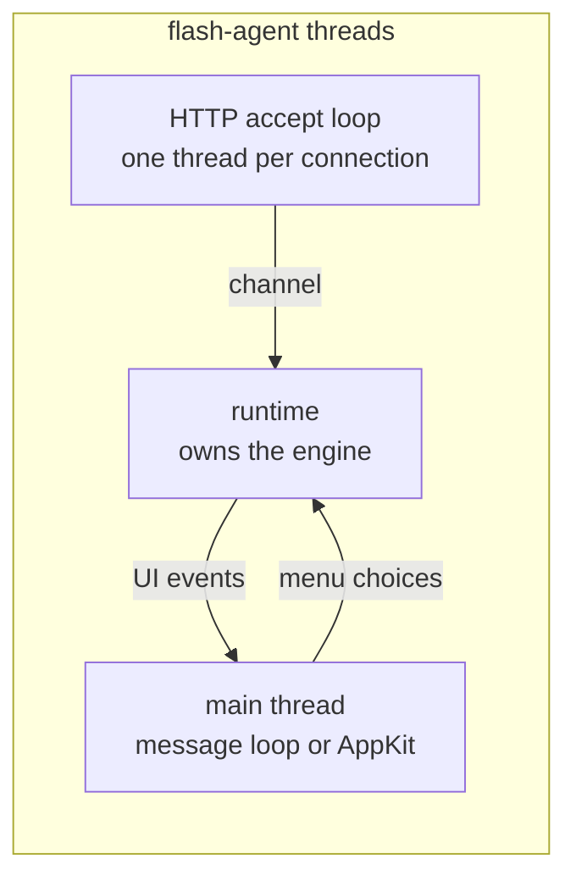

# How it works

[README](../README.md) · [Configuration](configuration.md) ·
[Local API](api.md) · [Security](../SECURITY.md)

## Components

Claude Flash is a Rust workspace with two crates.

**`flash-core`** holds everything that does not depend on an operating system, and
does no I/O:

| Module | Responsibility |
|---|---|
| `engine` | The policy engine: from an event and the moment, what to show and what to record |
| `event` | Reading hook events, and what each one means |
| `config` | `config.toml`: parsing, validation, comment-preserving edits, conversion from 1.x |
| `render` | A flash's opacity over time, its shape on screen, and the tray icon |
| `settings` | Adding and removing hooks in Claude Code's `settings.json` |
| `http` | Request parsing and the admission checks for the local API |
| `journal`, `stats` | Journal records, and summaries of them |
| `color`, `duration`, `glob`, `time` | Small value types and helpers |

**`claude-flash`** builds two programs. `flash-agent` runs in the background:



The HTTP server parses requests, applies admission, and passes hook events,
signals and controls to the runtime over a channel. The runtime owns the engine,
feeds it a tick every second and at each deadline the engine reports, reloads the
settings file when it changes, writes the journal and persists the switches. What
the engine decides to show goes to the front end on the main thread, which is the
only thread allowed to create windows on Windows and macOS.

`flash` is the command line. It talks to the agent over the same HTTP API as any
other client, reads the journal directly for `log` and `stats`, and edits the
settings file and `settings.json` itself.

## Hooks

`flash install` adds one group per event to `~/.claude/settings.json`:

| Event | Matcher | Hook |
|---|---|---|
| `SessionStart` | none | command: `flash agent ensure` |
| `UserPromptSubmit`, `Stop`, `StopFailure`, `SessionEnd` | none | HTTP |
| `PermissionRequest`, `PostToolUse`, `PostToolUseFailure`, `PermissionDenied`, `Elicitation`, `ElicitationResult`, `Notification` | `*` | HTTP |
| `PreToolUse` | `AskUserQuestion` | HTTP |

HTTP hooks post the event to the agent without starting a process. Each carries
the header `X-Claude-Flash`, which also marks the entry as Claude Flash's when
`settings.json` is edited again, and `X-Claude-Flash-Session: ${CLAUDE_FLASH}`,
which Claude Code fills from the session's environment. A value of `off` drops the
event.

`SessionStart` is different because the agent may not be running when a session
starts, and all hooks for an event run in parallel, so an HTTP hook would race
whatever starts the agent. Instead the session runs `flash agent ensure` in exec
form, without a shell. It checks the agent's health, starts it if needed, forwards
the `SessionStart` event itself, and prints nothing, since anything a
`SessionStart` hook prints becomes part of Claude's context.

Editing `settings.json` removes only entries Claude Flash wrote, in this version
or 1.x, and appends its own groups after everyone else's. Top-level keys keep their
order. A file that does not parse is left untouched, and a file whose meaning would
not change is not rewritten at all.

## Deciding what to show

Each event is classified:

| Event | Effect |
|---|---|
| `Stop` | Done |
| `StopFailure` | Error |
| `PermissionRequest` | Approval, waiting on its `tool_use_id` |
| `PreToolUse` for `AskUserQuestion` | Question, waiting on its `tool_use_id` |
| `Elicitation` | Question, waiting |
| `Notification` of type `permission_prompt` | Approval, waiting |
| `Notification` of type `elicitation_dialog`, `elicitation_url_dialog` or `agent_needs_input` | Question, waiting |
| `PostToolUse`, `PostToolUseFailure`, `PermissionDenied` | Ends the wait with that `tool_use_id` |
| `ElicitationResult` | Ends waits without an id |
| `UserPromptSubmit` | Marks the session as yours, and ends its waits |
| `SessionEnd` | Ends the session's waits |

A turn that finishes or fails also ends whatever it was still waiting on.

### Waits

Claude Code announces some dialogs twice: a `PermissionRequest` and a
`permission_prompt` notification for the same prompt, in either order. A second
wait of the same kind in the same session within five seconds is treated as the
first one, and takes its `tool_use_id` if the first had none, so the dialog flashes
once and its answer ends it.

Waits are what `flash status` lists, what reminders repeat, and what the journal
measures: the record that ends a wait carries `waited_ms`, the time Claude spent
blocked on you.

### Background sessions

A prompt can start subagents, and scripts can start whole sessions, none of which
you are waiting on. A session counts as yours once it sends `UserPromptSubmit`;
with `sessions.ignore_background` on, signals from other sessions are held back.
Known sessions are saved and remembered for seven days, so an agent restart does
not forget them. Until at least one session is known, nothing is held back: going
silent is the worse failure for a tool whose job is to be noticed.

### Delivery

A raised signal passes these checks in order, and the first that applies decides
the outcome:

1. Flashes are switched off: held back.
2. Flashes are paused: held back.
3. A `[[project]]` rule mutes the project: held back.
4. The signal is turned off in `[signals]`: held back.
5. The session is in the background: held back.
6. It is quiet hours: held back, with a notification if `quiet_hours.notify` is on.
7. You are away: a notification, a push if you have been away long enough and the
   kind is in `push.kinds`, and the signal is kept for the return digest.
8. A listed application is focused: held back.
9. Otherwise, it flashes.

Every outcome, including each reason for holding a signal back, is written to the
journal.

### Rate limit

Flashes start at least `flash.min_interval_ms` apart, 1000 ms by default and never
less than 334 ms, which keeps any burst within three flashes per second, the WCAG
2.3.1 general flash threshold. A signal arriving during the interval is dropped if
it is no more urgent than the flash that just started, because that flash already
covered it. A more urgent one, such as an approval arriving just after a done
flash, is shown when the interval ends. A queued flash that comes due at the same
moment as a new signal goes first, and the new signal is weighed against it, so two
flashes never start together. The order of urgency is done, error, question,
approval.

### Presence

The runtime reads the time since the last keyboard or mouse input on every tick.
Past `presence.away_after`, you count as away, and signals turn into notifications
and pushes as above. On your return the engine flashes once, in the colour of the
most urgent signal among the waits still open and the signals that arrived while
you were gone, unless you come back to an application listed in
`flash.skip_when_focused`.

### Reminders

With `flash.remind_after` set, every open wait flashes again each time that long
passes without an answer, unless you are away, paused, switched off, in quiet
hours or looking at an application listed in `flash.skip_when_focused`. A reminder
held back that way is shown as soon as nothing stands in its way.

### Testing the engine

The engine takes the time as input rather than reading a clock, so its behaviour
can be pinned down exactly. The files in `spec/scenarios` each feed it a sequence of
events, signals, controls and clock movements, and list what every step must
produce, such as `["flash approval"]` or `["notify approval", "push approval"]`.
The same scenarios run on every platform in CI, and the runner fails if any outcome
the engine can produce is not covered by at least one of them.

## Drawing a flash

### Opacity over time

A flash fades in over `fade_in_ms` with an ease-out curve, holds at the signal's
opacity for `hold_ms`, and fades out over `fade_out_ms` with an ease-in-out curve.
A key press or a click after `min_visible_ms` starts a `dismiss_fade_ms` fade from
whatever opacity the flash had reached. When the system asks for reduced motion,
both fades become short cross-fades and the hold lengthens, so the flash is still
noticed.

### Shape

The wash covers the whole screen, stronger at the edges than in the centre. With
`x` and `y` running from −1 to 1 across the screen, the alpha at each point is

```text
1 − vignette · (1 − x²) · (1 − y²)
```

which is 1 at the edges and `1 − vignette` in the middle, so the centre, where you
are usually reading, stays clearer. The `edge` style instead glows in a band 14% of
the screen's shorter side, falling off quadratically, with a clear centre.

Both shapes are separable into a term per column and a term per row, so painting a
4K display is a multiply per pixel rather than a distance calculation.

### Windows

The agent creates one window per monitor with `WS_EX_LAYERED`,
`WS_EX_TRANSPARENT`, `WS_EX_TOPMOST`, `WS_EX_TOOLWINDOW` and `WS_EX_NOACTIVATE`:
it is composited with per-pixel alpha, lets clicks through, stays on top, stays out
of Alt+Tab and never takes focus. The pixels are painted once into a DIB section in
premultiplied BGRA and handed over with `UpdateLayeredWindow`. Each frame of the
fade then calls `UpdateLayeredWindow` again with only a new constant alpha, which
the compositor applies without repainting. The process is per-monitor DPI aware, so
each window covers its monitor exactly.

Because the windows take no input, dismissal is detected without them. The system's
last-input time advances with any input; when it has, and the pointer has not moved
or a mouse button is down, the user pressed a key or clicked. This needs no keyboard
hook and never reads which key was pressed.

The tray icon is drawn at the system's small icon size in the colour of the current
state. Notifications are tray balloons without sound, which Windows 10 and 11 show
as toasts.

### macOS

The agent is an accessory application: it has a menu bar item and no Dock icon.
Each display gets a borderless window at the screen-saver level that ignores mouse
events and joins every Space, including those of full-screen apps. Its content is an
image view showing the wash, painted at a fixed width of 480 pixels and scaled to the
display; the wash is a smooth gradient, so scaling loses nothing. The fade animates
the window's alpha from a 60 Hz timer.

Dismissal reads when a key press or a mouse click last happened from
`CGEventSourceSecondsSinceLastEventType`. Unlike an event tap, this needs no
Accessibility or Input Monitoring permission.

Notifications are sent with `osascript`, passing the title and text as arguments
rather than as script source.

## What is kept on disk

| File | Contents |
|---|---|
| `config.toml` | Settings. Reloaded when its modification time or size changes |
| `state.json` | The on/off switch, the end of a pause, and the sessions known to be yours |
| `token` | The API token |
| `journal/YYYY-MM-DD.jsonl` | One record per line, one file per local day, pruned after `journal.retain_days` |
| `agent.log` | Startup, configuration problems and failures. Rotated past 1 MB |

State and settings files are written to a temporary file and renamed into place, so
a reader never sees half a file.
